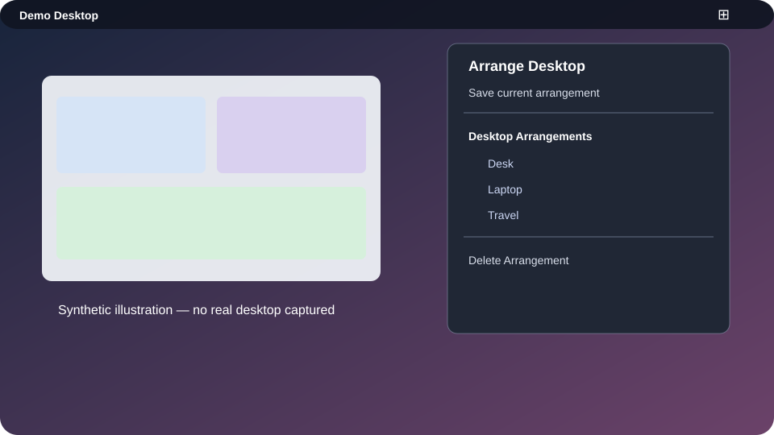

# ArrangeDesktop

`ArrangeDesktop.spoon` saves and restores application-window geometry per
display. It is useful when moving between a laptop-only setup, a desk with one
external display, and a multi-display setup.

## Save an arrangement

1. Arrange the windows exactly as you want them.
2. Open the `⊞` menu-bar menu.
3. Choose **Save current arrangement** or **Create Desktop Arrangement**.
4. Confirm the prompt and enter an arrangement name such as `Desk` or
   `Laptop`.
5. When prompted, name each monitor. These names are labels for humans; the
   display UUID is what identifies a monitor on that Mac.

The Spoon briefly focuses each window while recording its frame. This is
expected behavior. The result is written to
`Spoons/ArrangeDesktop.spoon/config.json`.

## Restore or delete an arrangement

Choose an arrangement from **Desktop Arrangements** in the `⊞` menu. Only
applications that are currently running can be positioned; the Spoon does not
launch missing applications. Use **Delete Arrangement** to remove a saved
layout after confirming the warning.

## Display changes

The root configuration watches for display changes. After a short two-second
settling period, it reapplies the first saved arrangement. If there is no saved
arrangement, Hammerspoon shows a reminder to create one.

This automatic behavior is deliberately conservative: it does not guess which
arrangement matches a new monitor topology. If you keep several layouts, choose
the correct one manually from the menu after the displays settle.

## Portability limitations

Arrangement files are machine state, not portable application settings. They
include:

- display UUIDs;
- absolute window coordinates and dimensions; and
- application names that happened to be open when the layout was recorded.

For that reason, the live `config.json` is ignored by Git. The repository
contains [a sanitized example](../Spoons/ArrangeDesktop.spoon/config.example.json)
instead.

## Synthetic illustration

This SVG is a made-up illustration for documentation. It is not a screenshot
of a real desktop.
