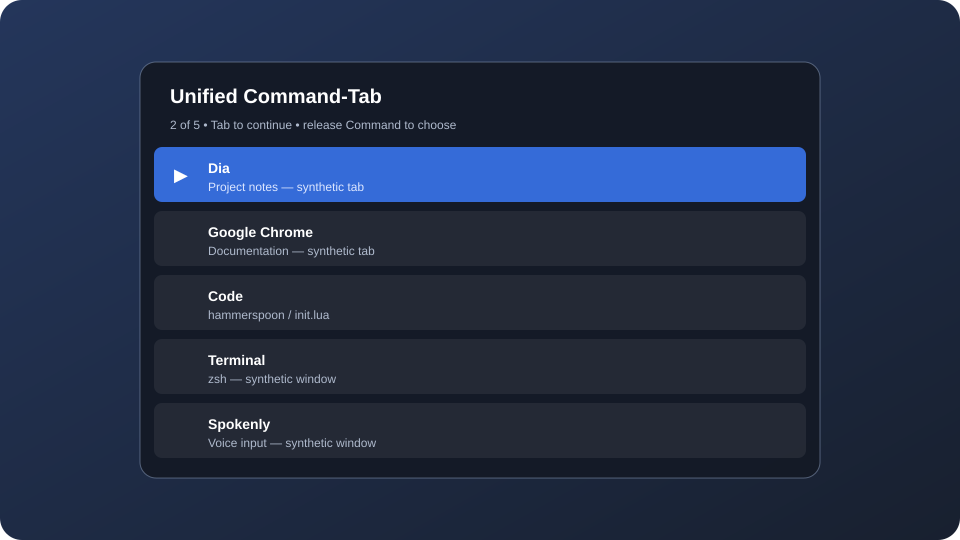

# Unified Command-Tab

The `UnifiedCommandTab` Spoon makes application windows and selected browser
tabs share one most-recently-used history. Its implementation is in
`Spoons/UnifiedCommandTab.spoon/init.lua`; load and start it with
`hs.loadSpoon("UnifiedCommandTab")` and
`spoon.UnifiedCommandTab:start()`.

## Supported targets

| Target | Identity tracked | Selection mechanism |
| --- | --- | --- |
| Ordinary app window | Bundle ID or application name + window ID | Focus the window after verifying its application identity |
| Google Chrome tab | Browser + tab ID | Activate the window and tab index |
| Dia tab | Browser + tab ID | Use Dia's `focus tab` AppleScript command |
| Spokenly | Application bundle ID | Activate the application |

The history contains up to 100 observed targets, not every open tab. Closed
windows are removed when Hammerspoon reports their destruction; complete browser
snapshots prune closed tabs. Moving a tab to another window keeps its identity.
Spokenly is eligible for history while it has windows. It has one application
entry even when its window and application both produce focus notifications.
Selection activates the application without rechecking its windows.

## Keyboard behavior

- `⌘Tab`: begin or advance the switcher in MRU order.
- `⌘⇧Tab`: move backward.
- Release `⌘`: activate the highlighted target and close the overlay.
- Press `Tab` repeatedly while holding `⌘`: change the highlight without
  activating every intermediate window.
- Click a row: commit that target. If the pressed target disappears or the
  pointer is released over another row, close without activating a substitute.

The overlay displays up to 12 rows on the originating window's display and
scrolls with the selection. It does not take keyboard focus. A 250 ms watchdog
finishes a cycle if Hammerspoon misses Command's release event.

Command-Tab keydowns and their trailing Tab keyup are suppressed. Modified
keydown combinations such as `⌘⌥Tab` pass through; Tab keyups are consumed while
a cycle is active. With fewer than two history entries, the native switcher is
allowed to handle Command-Tab.

## Menu and persistence

The second menu-bar item is labeled `⌘Tab`. Its menu can toggle the feature on
or off. The setting is stored using Hammerspoon's settings API under
`unifiedCmdTab.enabled`, so a reload keeps the last choice.
Disabling or stopping during a cycle commits the highlighted target. History is
in memory and is rebuilt after a configuration reload.

## Permissions

Accessibility permission is required for event monitoring and window focus.
Automation permission may be requested for Google Chrome and Dia because the
module uses AppleScript to read and select tabs. If a
browser does not appear in the switcher:

1. confirm the browser has at least one window;
2. reload Hammerspoon;
3. check **System Settings → Privacy & Security → Automation**; and
4. use the menu to confirm **Unified ⌘Tab** is enabled.

## Performance design

Browser discovery and metadata reads run in `/usr/bin/osascript` tasks. A 500 ms
timer samples the foreground browser's active tab and requests full snapshots
when 1.5 seconds have elapsed since the last full batch began. Beginning a cycle
also requests a full snapshot. Polling pauses during cycling and while disabled;
in-flight reads can still complete. Task duration can make observations older
than the polling interval.

Dia's accessibility tab-list notifications request a bulk-ID presence snapshot
without title reads. Periodic title snapshots remain the fallback. Queued reads
are coalesced, and generation checks prevent stale observations from restoring
tabs removed by a newer snapshot. Snapshot reconciliation indexes the current
target copies once rather than scanning history for every open tab.

Cycling uses cached targets and coalesces overlay redraws onto the next run-loop
turn. Completion clears cycle state and hides the overlay before attempting
activation. Browser activation uses synchronous `hs.osascript.applescript`;
only successful selections become the most recent target. Dia resolves the tab
by stable ID in its recorded window, then searches other windows if needed.
It does not request each tab's ID separately. Chrome validates its cached tab
index against the stable ID before selecting it.

See [verification and benchmarks](unified-command-tab-verification.md) for
regression coverage, reproducible commands, measured results, and validation
that still requires a live session.

## Extending the switcher

To add a browser, update the allowlist near the top of
`Spoons/UnifiedCommandTab.spoon/init.lua`, then implement its read and selection
AppleScript paths. Accessory apps use a separate allowlist and application
activation; the current normalization and cleanup rules are Spokenly-specific.
Keep these rules intact:

- keep discovery and metadata queries out of the keyboard event callback;
- use a stable identity for each target;
- avoid recording intermediate focus changes during a cycle; and
- remove targets when their window or application disappears.

## Synthetic illustration

This SVG is a made-up illustration for documentation. It is not a capture of
Chrome, Dia, Spokenly, or any actual browser session.
